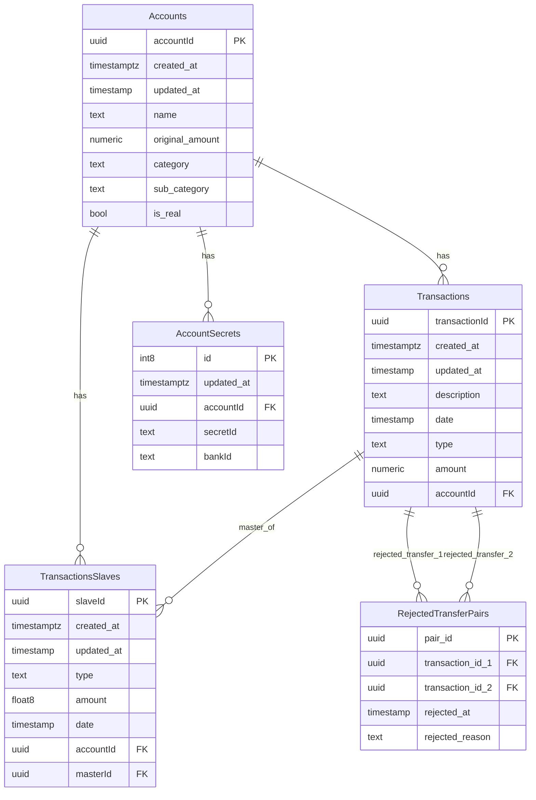

# Architecture de la Base de Données

## Description des Tables

### Accounts
Table principale contenant les comptes bancaires et budgets.
- **accountId**: Identifiant unique du compte
- **name**: Nom du compte
- **original_amount**: Montant initial
- **category**: Catégorie du compte
- **sub_category**: Sous-catégorie
- **is_real**: Indique si c'est un vrai compte bancaire ou un budget virtuel

### Transactions
Table des transactions principales.
- **transactionId**: Identifiant unique de la transaction
- **description**: Description de la transaction
- **date**: Date de la transaction
- **type**: Type de transaction
- **amount**: Montant (numeric pour précision)
- **accountId**: Référence vers le compte

### TransactionsSlaves
Table des transactions esclaves (transactions liées/dépendantes).
- **slaveId**: Identifiant unique de la transaction esclave
- **type**: Type de transaction
- **amount**: Montant (float8)
- **date**: Date de la transaction
- **accountId**: Référence vers le compte
- **masterId**: Référence vers la transaction maître

### AccountSecrets
Table contenant les secrets/credentials pour les comptes bancaires.
- **id**: Identifiant unique
- **accountId**: Référence vers le compte
- **secretId**: Identifiant du secret
- **bankId**: Identifiant de la banque

### RejectedTransferPairs
Table des paires de transactions de transfert rejetées.
- **pair_id**: Identifiant unique de la paire
- **transaction_id_1**: Première transaction du transfert
- **transaction_id_2**: Seconde transaction du transfert
- **rejected_at**: Date du rejet
- **rejected_reason**: Raison du rejet
