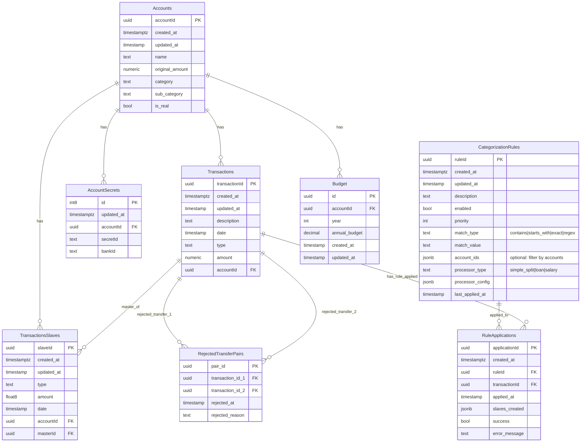

# Architecture de la Base de Données

## Description des Tables

### Accounts
Table principale contenant les comptes bancaires et budgets.
- **accountId**: Identifiant unique du compte
- **name**: Nom du compte
- **original_amount**: Montant initial
- **category**: Catégorie du compte
- **sub_category**: Sous-catégorie
- **is_real**: Indique si c'est un vrai compte bancaire ou un budget virtuel

### Transactions
Table des transactions principales.
- **transactionId**: Identifiant unique de la transaction
- **description**: Description de la transaction
- **date**: Date de la transaction
- **type**: Type de transaction
- **amount**: Montant (numeric pour précision)
- **accountId**: Référence vers le compte

### TransactionsSlaves
Table des transactions esclaves (transactions liées/dépendantes).
- **slaveId**: Identifiant unique de la transaction esclave
- **type**: Type de transaction
- **amount**: Montant (float8)
- **date**: Date de la transaction
- **accountId**: Référence vers le compte
- **masterId**: Référence vers la transaction maître

### AccountSecrets
Table contenant les secrets/credentials pour les comptes bancaires.
- **id**: Identifiant unique
- **accountId**: Référence vers le compte
- **secretId**: Identifiant du secret
- **bankId**: Identifiant de la banque

### RejectedTransferPairs
Table des paires de transactions de transfert rejetées.
- **pair_id**: Identifiant unique de la paire
- **transaction_id_1**: Première transaction du transfert
- **transaction_id_2**: Seconde transaction du transfert
- **rejected_at**: Date du rejet
- **rejected_reason**: Raison du rejet

### CategorizationRules
Table des règles de catégorisation automatique des transactions.
- **ruleId**: Identifiant unique de la règle
- **description**: Description de la règle
- **enabled**: Indique si la règle est active
- **priority**: Priorité d'application (plus haute = appliquée en premier)
- **match_type**: Type de matching du libellé (contains, starts_with, exact, regex)
- **match_value**: Valeur à matcher dans le libellé
- **account_ids**: JSON array optionnel des comptes concernés (filtre)
- **processor_type**: Type de processor (simple_split, loan, salary)
- **processor_config**: Configuration JSON du processor
- **last_applied_at**: Date de dernière application de la règle

### RuleApplications
Table des logs d'application des règles de catégorisation.
- **applicationId**: Identifiant unique de l'application
- **ruleId**: Référence vers la règle appliquée
- **transactionId**: Référence vers la transaction traitée
- **applied_at**: Date d'application de la règle
- **slaves_created**: JSON array des IDs des slaves créées
- **success**: Indique si l'application a réussi
- **error_message**: Message d'erreur en cas d'échec

### Budget
Table des budgets annuels par compte.
- **id**: Identifiant unique du budget
- **accountId**: Référence vers le compte
- **year**: Année du budget
- **annual_budget**: Montant du budget annuel (doit être >= 0)
- **created_at**: Date de création
- **updated_at**: Date de mise à jour

Contrainte d'unicité sur (accountId, year) : un seul budget par compte et par année.
